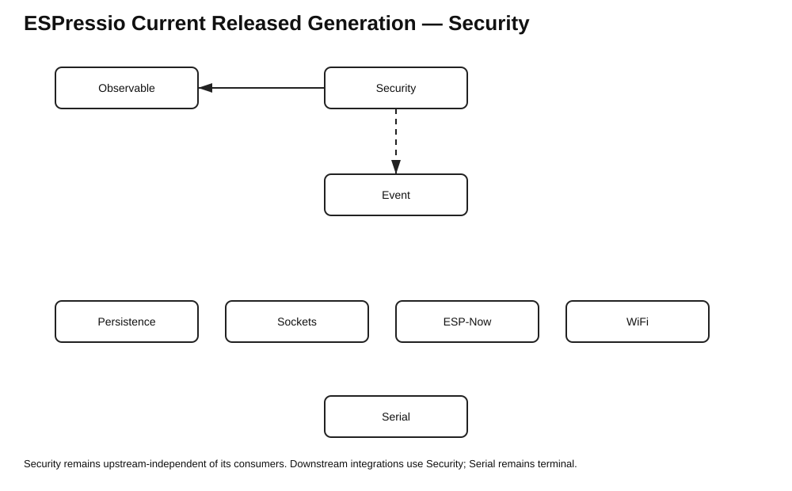

# ESPressio Dependency Chart — Security 0.4.0



Arrows point from a consuming library to the ESPressio library it consumes. Solid arrows are required dependencies; dashed arrows are opt-in integrations.

## Security 0.4.0

```text
Security 0.4.0
    -> Observable >= 3.0.2 < 4.0.0

Security Event integration
    - - -> Event >= 6.0.1 < 7.0.0
```

The new `IDataProtector` / `DataProtector` feature introduces **no new required dependency**. It deliberately reuses Security-owned AEAD, key-provider and random-source abstractions.

## Current released platform generation at feature start

```text
Observable    3.0.2
Serializable  0.10.3
Units         0.2.4
Timing        2.2.5
Threads       3.1.5
Event         6.0.1
Command       1.0.1
Security      0.3.1 -> 0.4.0 in this feature
Sockets       0.7.1
ESP-Now       0.8.1
Serial        0.7.3
Persistence   0.2.0
```

## Downstream feature cascade

The coordinated feature tranche is intended to add these **downstream/opt-in** relationships without introducing reverse dependencies:

```text
Serializable 0.11.x
    - - -> Security >= 0.4.0 < 1.0.0
            protected serialization/deserialization

Persistence 0.3.x
    - - -> Serializable >= 0.11.0 < 1.0.0
            protected typed persistence via Serializable integration

WiFi 0.1.x
    -> Observable
    -> Serializable
    -> Persistence
    - - -> Security
    - - -> Event
    - - -> Command

Serial
    - - -> WiFi
```

Security itself remains independent of Serializable, Persistence, WiFi, Sockets, ESP-Now, Command and Serial.

## Dependency-direction invariants

- Security owns cryptographic policy and implementation abstractions.
- Serializable may opt into Security; Security must not depend back on Serializable.
- Persistence may consume protected Serializable APIs; Security must not depend on Persistence.
- WiFi may use all three lower-order capabilities, but Security must remain unaware of WiFi.
- Serial remains terminal/downstream; no upstream ESPressio library should depend on Serial.
