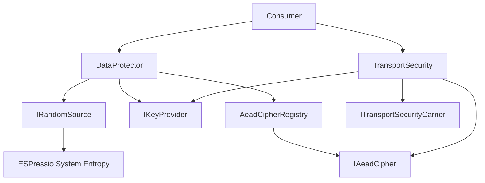

# Extension Architecture

Security extensions should preserve separation between cryptographic policy, key sourcing, entropy, and transport delivery.

## Extension boundaries

Use the narrowest interface appropriate to the new capability:

- new authenticated-encryption implementation → `IAeadCipher`;
- new key source → `IKeyProvider`;
- new random/entropy adapter → `IRandomSource`;
- new transport → integrate through Security's transport-carrier contract rather than embedding transport mechanics in Security.

## Rules

Extensions must not silently substitute algorithms, weaken `Required` policy, bypass authentication, disable replay checking, expose key material in envelopes, or introduce target SDK dependencies into portable Security abstractions.

Target-specific entropy remains beneath ESPressio System. Transport-specific mechanics remain with the transport library.