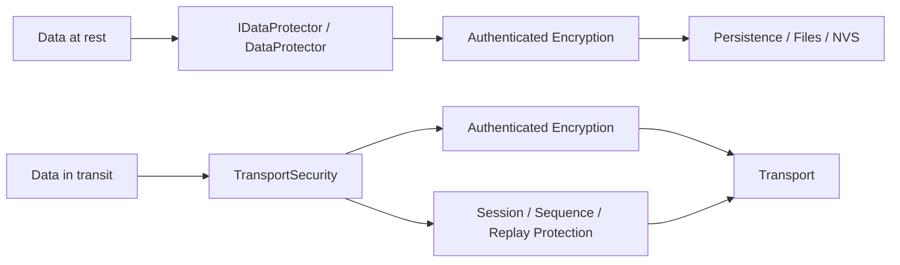

# ESPressio Security

> Documentation baseline: **1.0.0**

ESPressio Security provides authenticated data protection, transport security, replay protection, key abstraction, and cryptographically suitable random-source integration for the ESPressio Development Platform.

This Wiki documents the coordinated **1.0.0 baseline only**. Historical APIs and releases are intentionally out of scope.

## Two security responsibilities

Use `IDataProtector` / `DataProtector` when arbitrary data needs confidentiality plus integrity/authenticity. Use `TransportSecurity` when protocol traffic additionally needs sender/session/sequence/replay semantics.

## Choose your documentation path

### Using the library

- [Getting Started](Getting-Started)
- [Protecting Data](Protecting-Data)
- [Protection Contexts and Envelopes](Protection-Contexts-and-Envelopes)
- [Key Providers](Key-Providers)
- [Random Sources and Entropy](Random-Sources-and-Entropy)
- [Transport Security](Transport-Security)
- [Security Policies](Security-Policies)
- [Memory and Resource Limits](Memory-and-Resource-Limits)
- [Operational Guidance](Operational-Guidance)

### Extending the library

- [Extension Architecture](Extension-Architecture)
- [Implementing AEAD Ciphers](Implementing-AEAD-Ciphers)
- [Implementing Key Providers](Implementing-Key-Providers)
- [Implementing Random Sources](Implementing-Random-Sources)
- [Integrating Secure Transports](Integrating-Secure-Transports)
- [Testing Security Extensions](Testing-Security-Extensions)

## Dependencies

For the 1.0.0 architecture, Security depends on ESPressio System for platform/runtime capabilities such as entropy and memory policy, and on ESPressio Observable for observer infrastructure. Event integration remains optional rather than a core dependency.

Security deliberately does not own Persistence, WiFi, ESP-NOW, Serial, Sockets, or Command. Those libraries may consume Security without Security depending back on them.