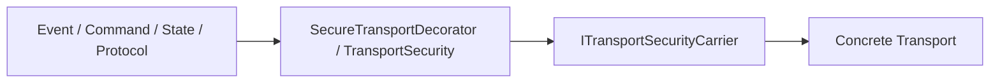

# Integrating Secure Transports

A transport library should remain responsible for peer addressing, framing, delivery, retries, connection lifecycle, and native I/O. ESPressio Security owns the cryptographic transport envelope and replay/session semantics.

## Carrier boundary

Integrate delivery through the Security carrier abstraction rather than making Security depend on a specific transport library.

Conceptually:

## Required invariants

A transport integration must preserve:

- protocol identity binding;
- sender/session identity;
- monotonically increasing sequence information;
- replay rejection;
- explicit SecurityPolicy semantics;
- authenticated payload bytes without unauthenticated mutation between protection and delivery.

## Policy handling

A transport must never silently send insecure traffic when policy is `Required`.

## Observability

Use `ITransportSecurityObserver` for security lifecycle observations. If the application uses ESPressio Event, the optional Event bridge may publish those observations without making Event a core Security dependency.

## Testing

Exercise secure round trips, cross-session traffic, replayed frames, out-of-window sequence values, sender/protocol mismatch, authentication failure, secure-carrier failure, and all three security policies.